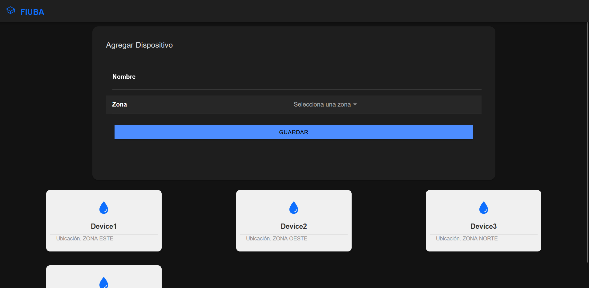
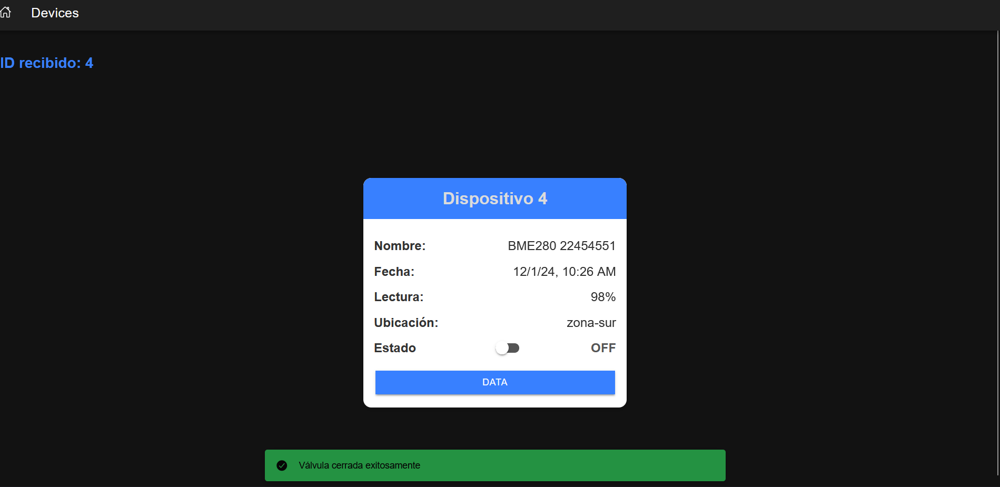
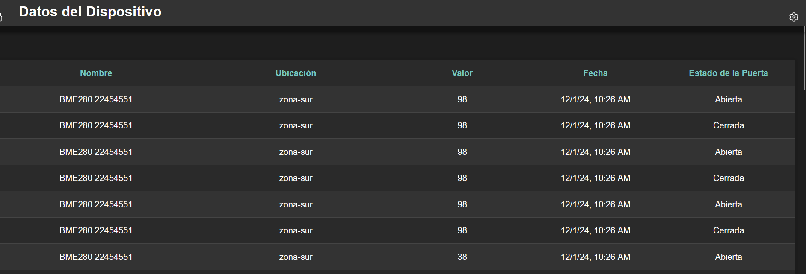

# Documentación del Proyecto

Este proyecto está compuesto por una aplicación de backend y frontend, diseñada para la gestión de dispositivos y sensores. A continuación, se explica la estructura y el uso de la aplicación.

## Estructura del Proyecto

### Backend
El **backend** se encuentra en la carpeta `backend` y contiene la lógica de la aplicación para agregar y leer la información importante de cada válvula y sensor de humedad. Se encarga de la gestión de datos y la comunicación con la base de datos.

### Frontend
El **frontend** es una aplicación hecha con **Ionic**, ubicada en la carpeta `frontend`. Está organizada de la siguiente manera:

- **src/**: Contiene los subdirectorios `routes`, `pages`, `components`, `pipes`, y `services`, cada uno con su respectiva funcionalidad.
- **pages**: Aquí se encuentran las páginas principales de la aplicación, que incluyen:
  - **Home**: Página principal.
  - **Devices**: Vista de dispositivos.
  - **Data**: Información y gestión de datos.
- La aplicación carga por defecto la página **Home**.

### Imágenes de Ejemplo





## Comandos para Levantar la Aplicación

Para ejecutar la aplicación, utiliza los siguientes comandos en la raíz del proyecto:

- **Para iniciar la aplicación:**
  ```bash
  docker compose up
  ```

- **Para la primera vez (construcción de imágenes):**
  ```bash
  docker compose up --build
  ```

Estos comandos levantarán tanto el backend como el frontend para que puedas probar y utilizar la aplicación.

---

Espero que esta guía te ayude a entender la estructura y cómo ejecutar el proyecto.
